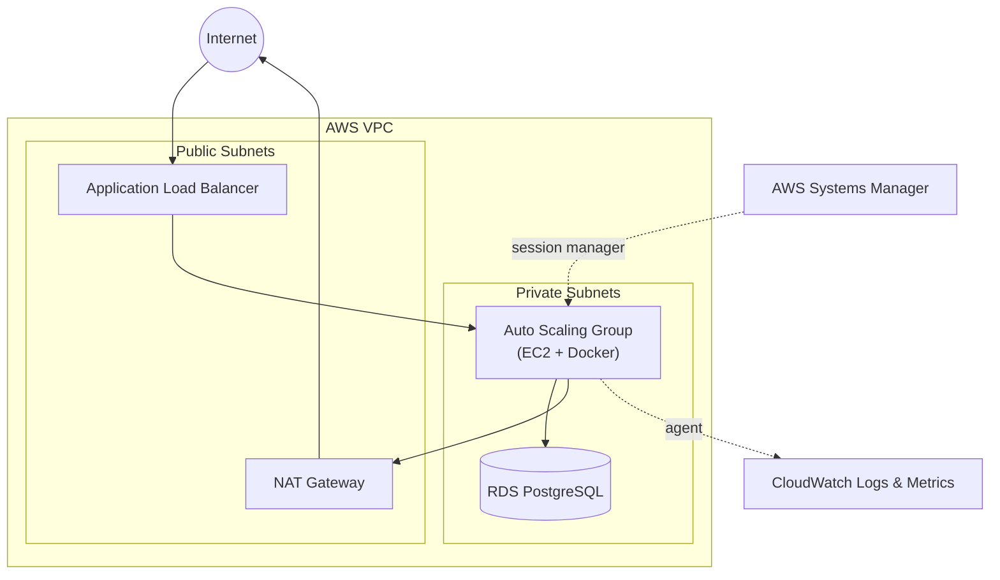
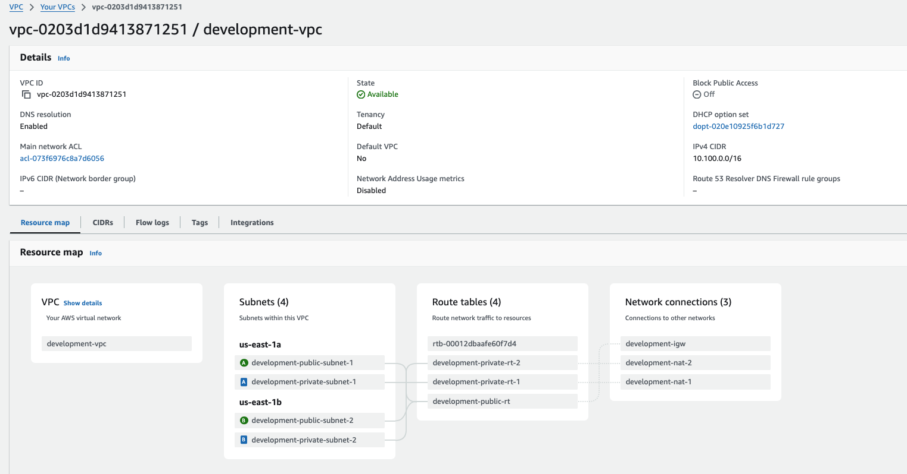
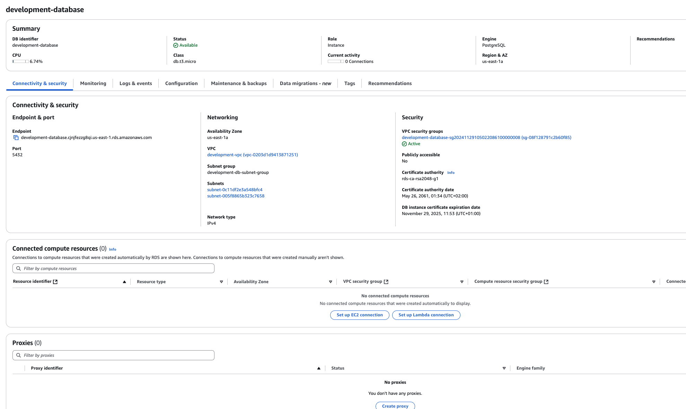

# Architecture Overview

```mermaid
flowchart TB
    Internet((Internet))

    subgraph VPC["AWS VPC"]
        subgraph Public["Public Subnets"]
            ALB["Application Load Balancer"]
            NAT["NAT Gateway"]
        end

        subgraph Private["Private Subnets"]
            ASG["Auto Scaling Group\n(EC2 + Docker)"]
            RDS[("RDS PostgreSQL")]
        end
    end

    SSM["AWS Systems Manager"]
    CW["CloudWatch Logs & Metrics"]

    Internet --> ALB --> ASG
    ASG --> RDS
    ASG --> NAT --> Internet
    SSM -. session manager .-> ASG
    ASG -. agent .-> CW
```

## Components

- AWS VPC with public and private subnets
- Application Load Balancer (ALB)
- Auto Scaling Group (ASG) of EC2 instances running Docker
- AWS RDS Database (PostgreSQL)
- AWS CloudWatch Monitoring (log groups via the CloudWatch agent)
- Access via AWS Systems Manager Session Manager — no SSH key distribution required

## Network Flow

1. Traffic enters through the ALB in the public subnets
2. Requests are distributed to EC2 instances in the private subnets
3. Instances connect onward to RDS, also in the private subnets
4. Outbound instance traffic (updates, package installs) routes through the NAT Gateway
5. Operational access to instances happens via SSM Session Manager, not direct SSH

## Deployed Infrastructure

Screenshots from an actual `terraform apply` run:

