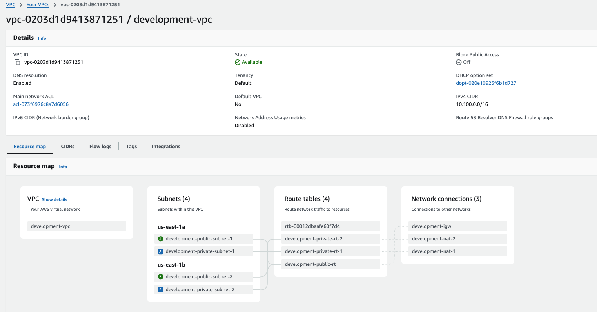

# Architecture Overview

## Components

- AWS VPC with Public and Private Subnets

- Application Load Balancer (ALB)
- Auto-Scaling Group (ASG)
- AWS RDS Database (PostgreSQL)

- AWS EC2 Instances
- AWS CloudWatch Monitoring

## Network Flow

1. Traffic enters through ALB
2. Requests are distributed to EC2 instances
3. Application connects to RDS in Private Subnet
